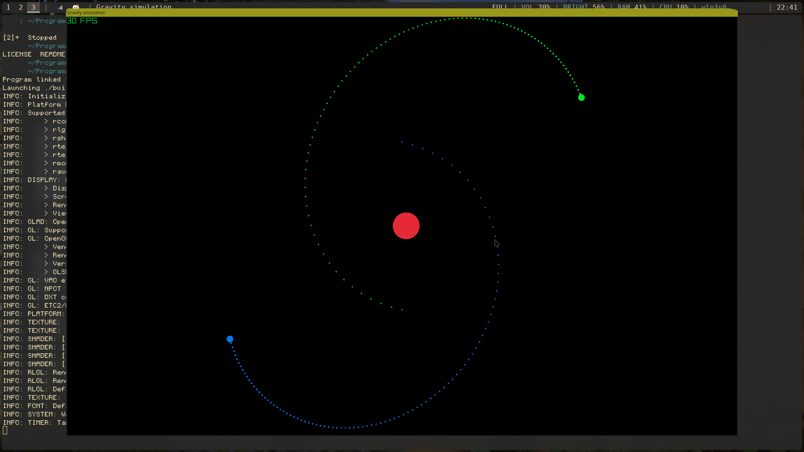
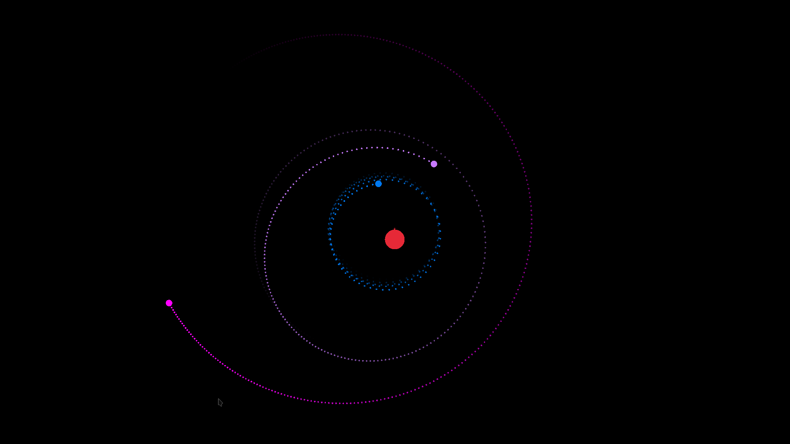

# PlanetSim
This is a fun little project I made after being inspired by a friend (their
repo can be found here: https://github.com/KiandroDW/gravity_sim). I decided
this was a good moment to try the interesting [C3 language](https://c3-lang.org/).
Paired with [Raylib](https://www.raylib.com/), this turned out to be quite the
breeze actually, and lots of fun!


## Features
`Configuration`s are created in code and are then simulated.

While the simulation is running, you can toggle following a planet with `T`. This will
keep a planet in the middle of the screen; you can select different planets to
follow using the number-keys.
When you want to go back to the actual origin, use `Z`.

You can zoom using `-` and `+` (or `-` and `=` to be correct).

Toggle an `FPS` counter, `scaling` value (zoom) and virtual origin with `F3`.


## Try it yourself
Download the C3 compiler from
https://c3-lang.org/getting-started/prebuilt-binaries/ or
install it from source through the official instructions:
https://c3-lang.org/getting-started/compile/
.

Clone this repo:
```sh
git clone https://github.com/BWindey/PlanetSim.git
```

And `c3c run` inside the project. If everything goes well, you should see
something like this:



